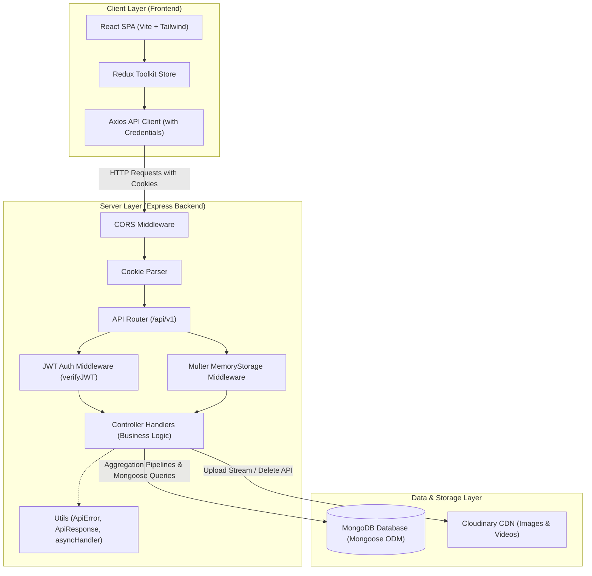
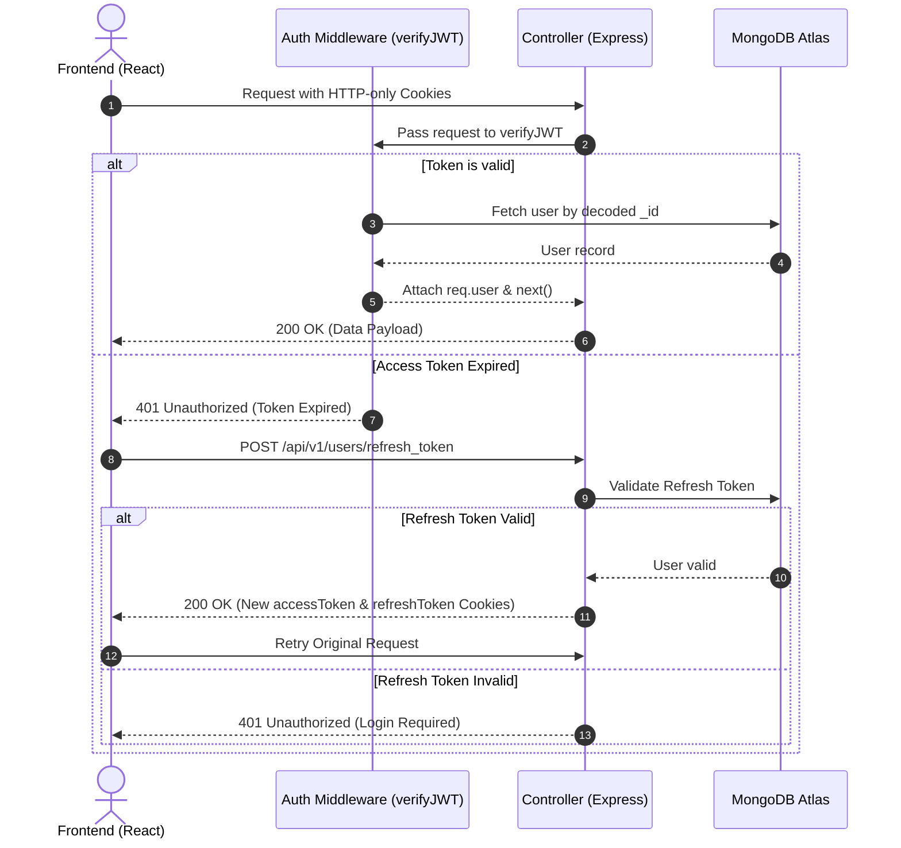
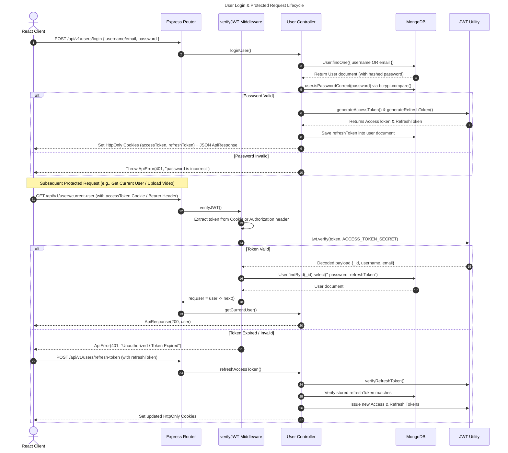
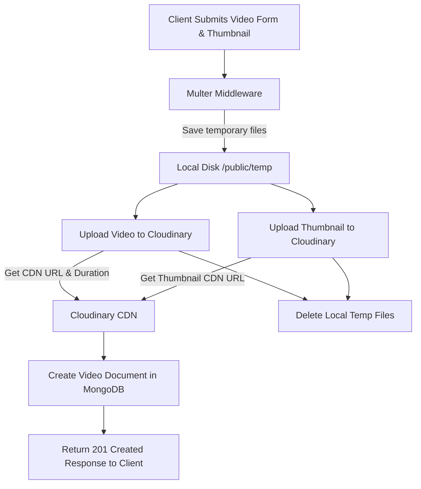

# Video Mela - Backend API Service

A production-ready, decoupled RESTful backend API for **Video Mela**—a modern video streaming and content-sharing platform built with Node.js, Express, MongoDB Atlas, Cloudinary, and JWT Authentication.

---

## 🔗 Quick Links
- **Backend GitHub Repo**: [https://github.com/vikrant48/Video_Mela_backend](https://github.com/vikrant48/Video_Mela_backend)
- **Frontend GitHub Repo**: [https://github.com/vikrant48/Video_Mela_frontend](https://github.com/vikrant48/Video_Mela_frontend)
- **Data Model Workspace**: [Eraser.io Design Workspace](https://app.eraser.io/workspace/OO3HFmjKmUYmLl8JiwRk?origin=share)

---

## 🚀 Key Features

- **JWT Authentication & Security**: Secure HTTP-only cookies (`accessToken` & `refreshToken`), password encryption via `bcrypt`, and auto token renewal.
- **Media Upload Pipeline**: Streaming video and image uploads powered by `Multer` and `Cloudinary` CDN storage.
- **MongoDB Aggregation Pipelines**: Multi-stage aggregation queries for paginated video feeds, subscriber counters, comment threads, user watch history, and like states.
- **Robust Error Handling**: Custom API error class, unified status codes, and silent 401 interceptors.
- **Cold Start Optimization**: Integrated timeout handling for smooth Render deployment restarts.

---

## 🛠️ Technology Stack

- **Runtime Environment**: Node.js
- **Web Framework**: Express.js
- **Database & ODM**: MongoDB Atlas & Mongoose
- **Storage & CDN**: Cloudinary Media Management
- **File Parsing**: Multer middleware
- **Security & Tokens**: JSON Web Tokens (`jsonwebtoken`), `bcryptjs`, `cookie-parser`

---

## 📊 System Architecture & Diagrams

## 📐 1. High-Level System Architecture
VideoMela operates as a **Decoupled Client-Server SPA Architecture** with cloud media storage.

### 1. JWT Authentication & Refresh Flow

---

### 3. Video Upload & Cloudinary Processing Pipeline

---

